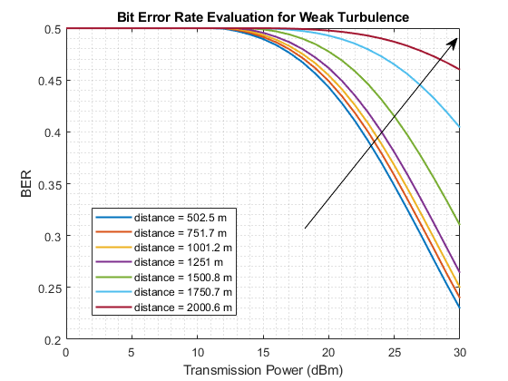
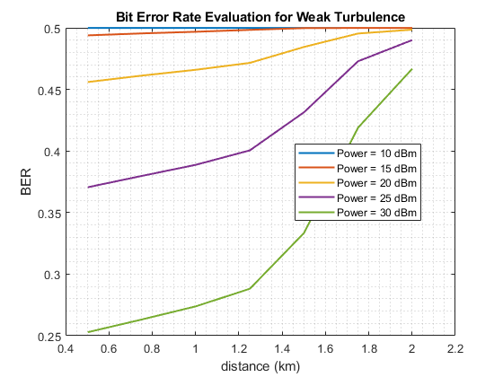
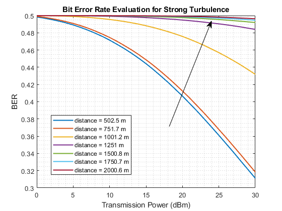
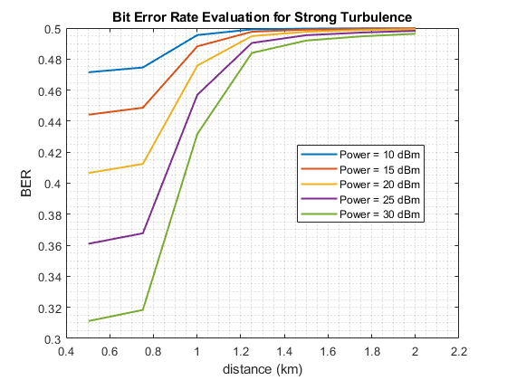

# Free-Space Optical Channel BER Analysis using Monte Carlo Simulation

## Overview

This repository presents a Monte Carlo simulation-based analysis of the Bit Error Rate (BER) in a free-space optical communication channel between a ground station and a drone flying at an altitude of 50 meters above the ground. The study explores the impact of various factors, including transmission power, distance, noise, path loss, and atmospheric conditions, on the BER performance of the optical link.

The simulation employs a Gaussian distribution for noise, assumes exponential path loss, and models symbol error using a Rayleigh distribution. The effect of weather conditions on BER is examined in both weak and severe scenarios. The modulation scheme considered is On-Off Keying (OOK).

## Problem Description

The primary goal of this project is to calculate and visualize the BER for a range of parameters:

- Transmission Power: 0 dBm to 30 dBm
- Distances: 500 meters to 2 kilometers
- Noise: Gaussian distribution
- Path Loss: Exponential
- Atmospheric Conditions: Weak and Severe scenarios
- Modulation: On-Off Keying (OOK)

Additionally, you have the option to investigate the impact of positional fluctuations on BER.

## Results

Upon executing the Monte Carlo simulation, a series of plots illustrating BER versus various parameters will be generated and saved in the `publish/` directory.

### BER vs Transmission Power ( Weak Turbulence Scenario)

### BER vs Distance ( Weak Turbulence Scenario)

### BER vs Transmission Power ( Strong Turbulence Scenario)

### BER vs Distance ( Strong Turbulence Scenario)

## License

This project is licensed under the MIT License. See the [LICENSE](LICENSE) file for details.
